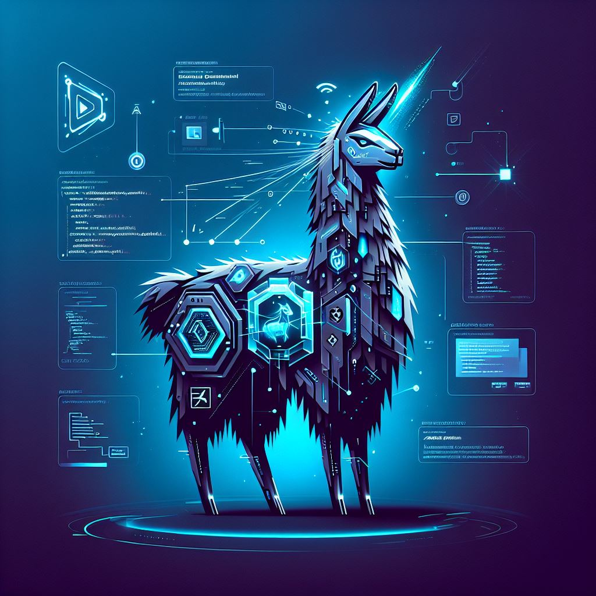

# LeetLLama

# 🦙 Welcome to **LeetLLama**

**LeetLLama** is a lightweight yet forward-thinking **proof of concept** (PoC) for an interactive, AI-augmented platform designed to empower aspiring software engineers through self-directed learning.

---

## 🎯 Purpose & Vision

The primary goal of this project—beyond _“reinventing the wheel for academic purposes”_—is to demonstrate a core philosophy in modern tech:

> **Artificial Intelligence should augment, not replace, human developers.**

In this PoC, we explore how **AI-driven tools** can enhance the way programmers learn complex topics like algorithms and data structures, providing a more personalized, adaptive, and contextual learning experience.

---

## 💡 Concept Overview

At its core, LeetLLama enables learners to:

- Interact with a **fine-tuned language model** trained on solved LeetCode-style problems.
- Receive guidance as if from a more experienced developer or mentor.
- Customize their learning journey based on:
  - ✏️ **Coding style**
  - 🧠 **Skill level**
  - 🎯 **Problem preferences** (difficulty, topic, and more)

The goal is to simulate the benefits of a **pair-programming** session with a senior engineer—one who not only knows the answers but can explain _why_ they work, and tailor their advice to your unique thinking process.

---

## 🧱 Tech Stack & Architecture
- 🐍 Python
- 📦 Dockerized microservice architecture
- 🧵 Message queue for asynchronous communication
- 🤖 LLM backend
- 💾 Vector store
- ☁️ Cloud-deployable with Kubernetes

# Requirements

| `Software`        | `Version` |
|-------------------|-----------|
| `Python`          | `3.11`    |
| `pip`             | `25.1`    |       
| `Docker`          | `28.1.1`  |
| `Docker-Compose`  | `2.36.0`  |

# Some Samples

---