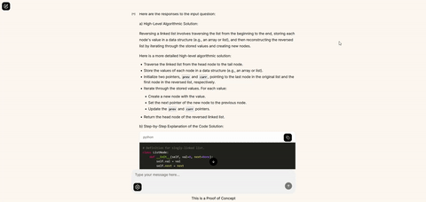
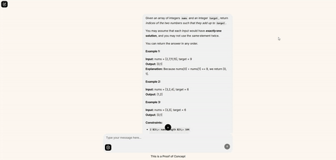

# 🦙 LeetLLama

[](https://aws.amazon.com/)
[](https://www.docker.com/)
[](https://kubernetes.io/)
[](https://www.python.org/)
[](https://ollama.com/)
[](https://www.gnu.org/licenses/gpl-3.0.html)


# Welcome to **LeetLLama**

**LeetLLama** is a lightweight yet forward-thinking **proof of concept** (PoC) for an interactive, AI-augmented platform designed to empower aspiring software engineers through self-directed learning.

---

## 🎯 Purpose & Vision

The primary goal of this project—beyond _“reinventing the wheel for academic purposes”_—is to demonstrate a core philosophy in modern tech:

> **Artificial Intelligence should augment, not replace, human developers.**

In this PoC, we explore how **AI-driven tools** can enhance the way programmers learn complex topics like algorithms and data structures, providing a more personalized, adaptive, and contextual learning experience.

---

## 💡 Concept Overview

At its core, LeetLLama enables learners to:

- Interact with a **fine-tuned language model** trained on solved LeetCode-style problems.
- Receive guidance as if from a more experienced developer or mentor.
- Customize their learning journey based on:
  - ✏️ **Coding style**
  - 🧠 **Skill level**
  - 🎯 **Problem preferences** (difficulty, topic, and more)

The goal is to simulate the benefits of a **pair-programming** session with a senior engineer—one who not only knows the answers but can explain _why_ they work, and tailor their advice to your unique thinking process.

---

## 🧱 Tech Stack & Architecture
- 🐍 Python
- 📦 Dockerized microservice architecture
- 🧵 Message queue for asynchronous communication
- 🤖 LLM backend
- 💾 Vector store
- ☁️ Cloud-deployable with Kubernetes

# Software Requirements

| `Software`        | `Version` |
|-------------------|-----------|
| `Python`          | `3.11`    |
| `pip`             | `25.1`    |       
| `Docker`          | `28.1.1`  |
| `Docker-Compose`  | `2.36.0`  |

# Hardware Requirements

> These are *minimun* requirements

|`Component`          | `Vendor`  |       `Model`      |
|---------------------|-----------|--------------------|
|   `CPU`             |  `Intel`  |      `8th Gen`     |
|  `GPU`              | `NVIDIA`  | `GeForce 4070 RTX` |
|  `RAM`              | `Any`     |      `DDR4`        |
|  `Secondary Memory` | `SSD`     |      `100 GB`      |

# Setup & Configuration

1) Start by *building* the entire project

```bash
docker compose build
```

2) Then *up* the project with

```bash
docker compose up -d
```

3) Connect to `ollama` to *download* the required models:

```bash
llama3.2:3b
qwen3:4b
phi3:3.8b
gemma3:4b
```

Using the commands:

(Connect to the ollama container)
```bash
docker exec -it leetllama_ollama /bin/bash
```
(Pull the models)
```bash
ollama pull llama3.2:3b && ollama pull qwen3:4b && ollama pull phi3:3.8b && ollama pull gemma3:4b
```

Then `exit`

4) Then, download all the `Python` dependencies required to populate the *Milvus* Knowledge Base with the ***Leetcode Dataset***, running this script:

(Download the requirements)
```bash
python -m pip install -r requirements.txt
```

(Populate the Milvus Vector Store)
```bash
cd ~/data
python load_milvus_kb.py
cd ../
```

5) Now you may connect to the *Frontend UI* at the following URL:

```bash
http://localhost:1291/
```


# Some Samples

This is the frontend UI you will see upon ***upping*** the `docker-compose` file.


The gear button aids with the selection of the ***models*** to be used for the ***inference***:


Then once you have chosen the model you seek, ***press the confirm button***


---

1) In this simple example, I asked how I could *invert a linked list*



2) In this more articulated example, I gave the model the entire question for the *infamous* `two sum` probelm



# Disclaimer

This repo is still an early ***PoC*** and not ready for being *forked*, once the `Cloud Setup` and `Better Architecture` will be implemented, then
you may proceed with ***forking*** the repo, and to know for sure, this message will **no longer appear in the README**

---